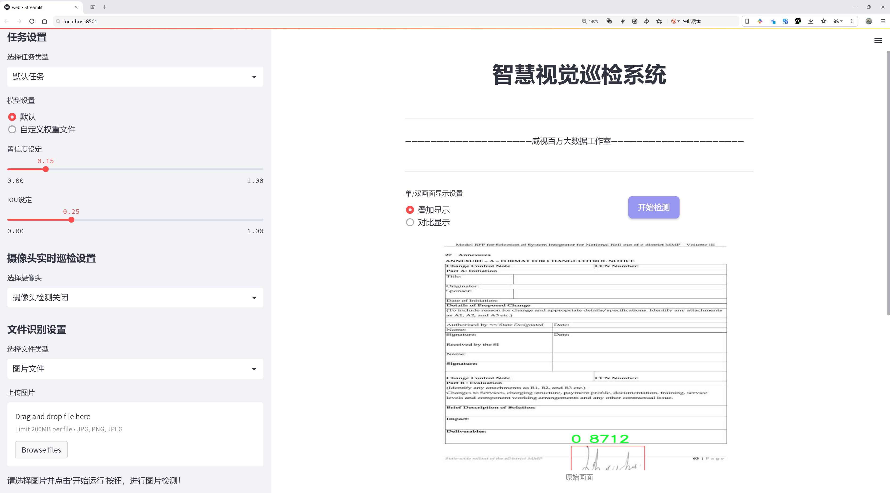
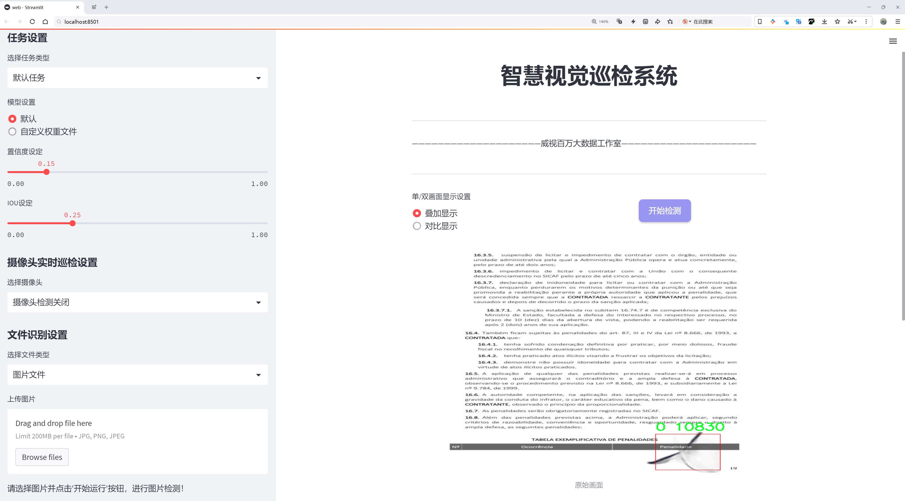
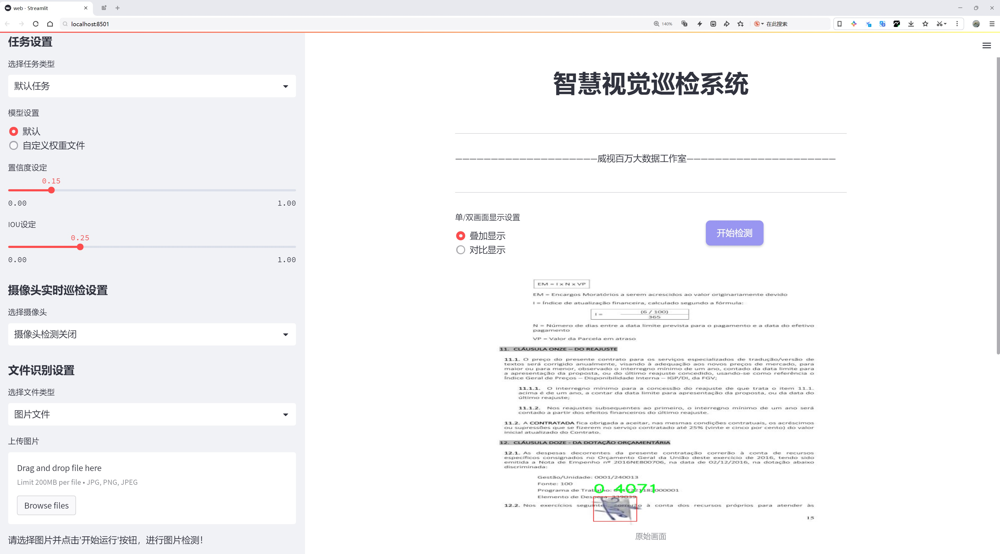
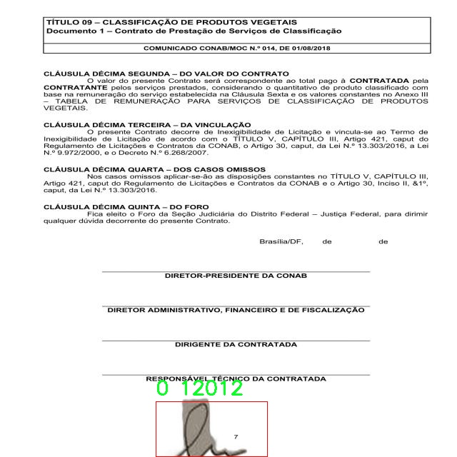
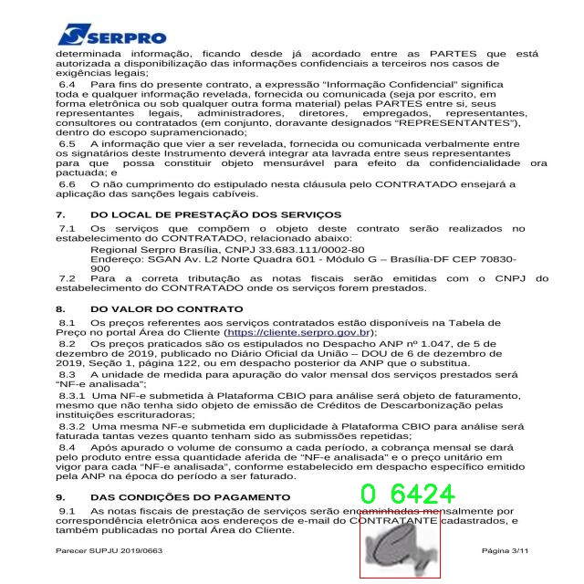
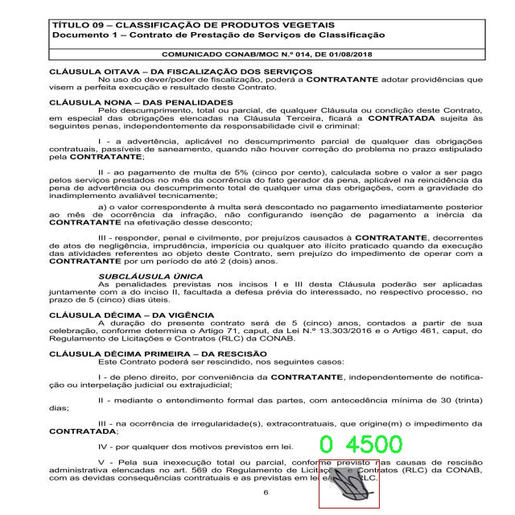
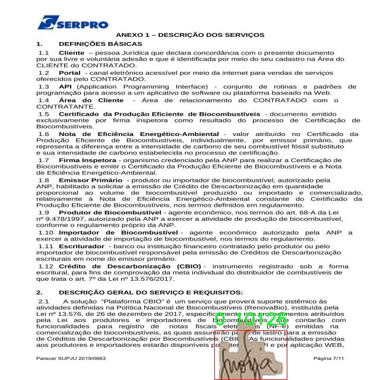
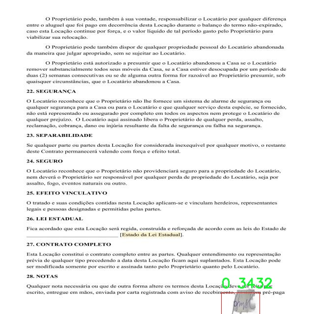

# 签名检测检测系统源码分享
 # [一条龙教学YOLOV8标注好的数据集一键训练_70+全套改进创新点发刊_Web前端展示]

### 1.研究背景与意义

项目参考[AAAI Association for the Advancement of Artificial Intelligence](https://gitee.com/qunshansj/projects)

项目来源[AACV Association for the Advancement of Computer Vision](https://gitee.com/qunmasj/projects)

研究背景与意义

随着信息技术的迅猛发展，数字化和自动化在各个领域的应用愈加广泛，尤其是在金融、法律和商业等行业中，签名作为一种重要的身份验证手段，其安全性和可靠性受到越来越多的关注。传统的手工签名验证方法不仅耗时耗力，而且容易受到人为因素的影响，导致验证结果的不准确性。因此，基于计算机视觉和深度学习技术的自动化签名检测系统应运而生，成为提高签名验证效率和准确性的有效手段。

在众多的深度学习模型中，YOLO（You Only Look Once）系列模型因其快速的检测速度和较高的准确率而备受青睐。YOLOv8作为该系列的最新版本，进一步提升了目标检测的性能，特别是在小目标检测和复杂背景下的表现。针对签名检测这一特定任务，基于改进YOLOv8的签名检测系统具有重要的研究价值和实际应用意义。该系统不仅能够实时检测和识别签名，还能有效地处理不同风格、不同尺寸和不同背景的签名图像，从而为签名验证提供更加可靠的技术支持。

本研究所使用的数据集“Deteccao de assinaturas”包含2000张签名图像，虽然类别数量仅为1，但这一数据集的构建为签名检测系统的训练和测试提供了基础。通过对该数据集的深入分析与处理，研究者可以提取出签名的特征信息，进而优化YOLOv8模型的结构和参数设置，以提高模型在签名检测任务中的表现。此外，数据集的多样性和丰富性将为模型的泛化能力提供保障，使其能够适应不同的应用场景。

在当前的研究背景下，签名检测系统的开发不仅有助于提升签名验证的自动化水平，还能在防止伪造签名、保护用户权益等方面发挥重要作用。通过改进YOLOv8模型，研究者可以探索如何更好地利用深度学习技术进行特征提取和目标检测，从而推动签名检测技术的发展。此外，该研究还可以为其他相关领域的目标检测任务提供借鉴，如手写文字识别、图像分类等，具有广泛的应用前景。

综上所述，基于改进YOLOv8的签名检测系统的研究，不仅具有重要的理论意义，也具备广泛的实际应用价值。通过深入探索该领域的前沿技术，研究者能够为签名验证的自动化、智能化发展贡献力量，为相关行业的数字化转型提供有力支持。

### 2.图片演示







##### 注意：由于此博客编辑较早，上面“2.图片演示”和“3.视频演示”展示的系统图片或者视频可能为老版本，新版本在老版本的基础上升级如下：（实际效果以升级的新版本为准）

  （1）适配了YOLOV8的“目标检测”模型和“实例分割”模型，通过加载相应的权重（.pt）文件即可自适应加载模型。

  （2）支持“图片识别”、“视频识别”、“摄像头实时识别”三种识别模式。

  （3）支持“图片识别”、“视频识别”、“摄像头实时识别”三种识别结果保存导出，解决手动导出（容易卡顿出现爆内存）存在的问题，识别完自动保存结果并导出到tempDir中。

  （4）支持Web前端系统中的标题、背景图等自定义修改，后面提供修改教程。

  另外本项目提供训练的数据集和训练教程,暂不提供权重文件（best.pt）,需要您按照教程进行训练后实现图片演示和Web前端界面演示的效果。

### 3.视频演示

[3.1 视频演示](https://www.bilibili.com/video/BV1ZetFeoEvV/)

### 4.数据集信息展示

##### 4.1 本项目数据集详细数据（类别数＆类别名）

nc: 1
names: ['0']


##### 4.2 本项目数据集信息介绍

数据集信息展示

在本研究中，我们使用了名为“Deteccao de assinaturas”的数据集，以改进YOLOv8的签名检测系统。该数据集专注于签名的识别与分析，旨在为机器学习模型提供高质量的训练数据，以提升其在签名检测任务中的准确性和鲁棒性。数据集的设计考虑到了签名的多样性和复杂性，确保模型能够在不同的场景和条件下有效地进行识别。

“Deteccao de assinaturas”数据集包含一个类别，具体类别标识为“0”。这一类别代表了所有签名的样本，虽然类别数量较少，但数据集的构建注重了样本的多样性和代表性。数据集中包含了大量的签名图像，这些图像来源于不同的个体和背景，涵盖了多种书写风格和笔迹特征。这种多样性使得模型在训练过程中能够学习到不同签名的特征，从而提高其在实际应用中的泛化能力。

在数据集的构建过程中，图像样本经过精心挑选和标注，确保每个样本都能准确反映出签名的特征。数据集中的图像分辨率高，细节清晰，能够为YOLOv8模型提供丰富的信息。这些图像不仅包括标准的签名样本，还涵盖了在不同光照条件、不同书写工具以及不同纸张背景下的签名，进一步增强了数据集的多样性。

为了确保模型的训练效果，数据集还进行了适当的数据增强处理。这些处理包括旋转、缩放、裁剪和颜色调整等，以模拟现实世界中可能遇到的各种情况。这种数据增强策略不仅提高了模型的鲁棒性，还有效地扩展了训练数据的数量，使得模型能够在更广泛的条件下进行学习。

在训练过程中，YOLOv8模型将利用“Deteccao de assinaturas”数据集中的图像进行特征提取和模式识别。通过不断的迭代训练，模型将逐步优化其参数，以提高对签名的检测精度。最终，经过充分训练的模型将能够在实时应用中快速、准确地识别和验证签名，为签名鉴定、金融交易和法律文件等领域提供可靠的技术支持。

总之，“Deteccao de assinaturas”数据集为本研究提供了坚实的基础，确保了YOLOv8模型在签名检测任务中的有效性和准确性。通过对数据集的深入分析和合理利用，我们期望能够显著提升签名检测系统的性能，为相关领域的应用提供更为高效和精准的解决方案。











### 5.全套项目环境部署视频教程（零基础手把手教学）

[5.1 环境部署教程链接（零基础手把手教学）](https://www.ixigua.com/7404473917358506534?logTag=c807d0cbc21c0ef59de5)


[5.2 安装Python虚拟环境创建和依赖库安装视频教程链接（零基础手把手教学）](https://www.ixigua.com/7404474678003106304?logTag=1f1041108cd1f708b01a)

### 6.手把手YOLOV8训练视频教程（零基础小白有手就能学会）

[6.1 手把手YOLOV8训练视频教程（零基础小白有手就能学会）](https://www.ixigua.com/7404477157818401292?logTag=d31a2dfd1983c9668658)

### 7.70+种全套YOLOV8创新点代码加载调参视频教程（一键加载写好的改进模型的配置文件）

[7.1 70+种全套YOLOV8创新点代码加载调参视频教程（一键加载写好的改进模型的配置文件）](https://www.ixigua.com/7404478314661806627?logTag=29066f8288e3f4eea3a4)

### 8.70+种全套YOLOV8创新点原理讲解（非科班也可以轻松写刊发刊，V10版本正在科研待更新）

由于篇幅限制，每个创新点的具体原理讲解就不一一展开，具体见下列网址中的创新点对应子项目的技术原理博客网址【Blog】：


[8.1 70+种全套YOLOV8创新点原理讲解链接](https://gitee.com/qunmasj/good)

### 9.系统功能展示（检测对象为举例，实际内容以本项目数据集为准）

图9.1.系统支持检测结果表格显示

  图9.2.系统支持置信度和IOU阈值手动调节

  图9.3.系统支持自定义加载权重文件best.pt(需要你通过步骤5中训练获得)

  图9.4.系统支持摄像头实时识别

  图9.5.系统支持图片识别

  图9.6.系统支持视频识别

  图9.7.系统支持识别结果文件自动保存

  图9.8.系统支持Excel导出检测结果数据


### 10.原始YOLOV8算法原理

原始YOLOv8算法原理

YOLOv8是由Ultralytics于2023年发布的最新目标检测模型，标志着YOLO系列算法的又一次重大进步。它在设计上融合了之前的多种先进技术，尤其是YOLOX、YOLOv6、YOLOv7和PPYOLOE等算法的优点，形成了一种高效、精确的检测方案。YOLOv8的核心理念是实现实时目标检测的同时，保持高精度和低延迟，这使得它在众多应用场景中都展现出了卓越的性能。

YOLOv8的网络结构分为四个主要部分：输入端、骨干网络、颈部网络和头部网络。输入端采用了马赛克数据增强技术，这种方法通过将多张图像拼接在一起，能够有效提升模型的泛化能力。此外，YOLOv8引入了自适应锚框计算和自适应灰度填充，进一步增强了输入数据的多样性和适应性。

在骨干网络方面，YOLOv8采用了CSP结构2，结合了C2f模块和SPPF模块。C2f模块是YOLOv8的关键创新之一，它通过对残差特征进行学习，利用更多的分支跨层连接，显著增强了模型的梯度流。这种设计使得YOLOv8在特征表示能力上得到了显著提升，能够更好地捕捉到复杂场景中的细节信息。而SPPF模块则通过空间金字塔池化技术，进一步提高了模型的计算速度和特征提取能力，使得YOLOv8在处理高分辨率图像时依然能够保持高效。

颈部网络采用了路径聚合网络（PAN）结构，这一设计旨在加强不同尺度对象的特征融合能力。通过对多层特征的有效聚合，YOLOv8能够更好地处理不同大小的目标，提高了对小目标的检测精度。这一创新在目标检测中尤为重要，因为许多实际应用场景中，目标的尺度差异往往会影响检测的准确性。

在头部网络中，YOLOv8采用了解耦头结构，这一结构将分类和检测过程分开处理。与传统的耦合头相比，解耦头能够更灵活地处理不同任务，提高了模型的整体性能。损失函数的设计也是YOLOv8的一大亮点，采用了Task-Aligned Assigner分配策略，根据分类与回归的分数加权结果选择正样本，从而优化了正负样本的分配。此外，YOLOv8在损失计算中结合了二元交叉熵损失（BCELoss）和分布焦点损失（DFLoss），以及完全交并比损失函数（CIOULoss），这使得模型在边界框预测的准确性上得到了显著提升。

YOLOv8的另一个重要创新是采用了Anchor-Free的检测方式，摒弃了传统的锚框预测机制。这一改变不仅减少了锚框的数量，还加速了非最大抑制（NMS）过程，使得模型在实时检测时更加高效。这种无锚框的设计理念符合现代目标检测的发展趋势，能够更好地适应复杂的场景和多样的目标。

总的来说，YOLOv8在网络结构、损失函数、样本分配和检测方式等多个方面进行了创新和优化，使得其在检测精度和速度上都达到了新的高度。这些改进不仅提升了模型的性能，也为实际应用提供了更强的支持。通过对YOLOv8的深入研究，我们可以更好地理解目标检测领域的前沿技术，并探索其在各类实际场景中的应用潜力。

在实际应用中，YOLOv8展现出了极大的灵活性和适应性。例如，在苹果采摘的场景中，YOLOv8能够利用其强大的视觉识别能力，自动检测和定位苹果。这一能力不仅提高了采摘的效率，也为农业自动化提供了新的解决方案。结合蚁群算法进行路径规划，能够使自动采摘机器人快速而准确地完成任务，进一步提升了农业生产的智能化水平。

通过对YOLOv8算法原理的深入分析，我们可以看到其在目标检测领域的广泛应用前景。随着技术的不断进步，YOLOv8无疑将为各行各业带来新的机遇和挑战，推动智能化发展的进程。


### 11.项目核心源码讲解（再也不用担心看不懂代码逻辑）

#### 11.1 70+种YOLOv8算法改进源码大全和调试加载训练教程（非必要）\ultralytics\nn\extra_modules\dynamic_snake_conv.py

以下是经过简化和注释的核心代码，保留了主要的功能和结构，同时添加了详细的中文注释。

```python
import torch
import torch.nn as nn
from ..modules.conv import Conv

__all__ = ['DySnakeConv']

class DySnakeConv(nn.Module):
    def __init__(self, inc, ouc, k=3) -> None:
        """
        动态蛇卷积层的初始化
        :param inc: 输入通道数
        :param ouc: 输出通道数
        :param k: 卷积核大小
        """
        super().__init__()
        
        # 初始化标准卷积和两个动态蛇卷积
        self.conv_0 = Conv(inc, ouc, k)  # 标准卷积
        self.conv_x = DSConv(inc, ouc, 0, k)  # 沿x轴的动态蛇卷积
        self.conv_y = DSConv(inc, ouc, 1, k)  # 沿y轴的动态蛇卷积
    
    def forward(self, x):
        """
        前向传播
        :param x: 输入特征图
        :return: 连接后的输出特征图
        """
        # 将三个卷积的输出在通道维度上连接
        return torch.cat([self.conv_0(x), self.conv_x(x), self.conv_y(x)], dim=1)

class DSConv(nn.Module):
    def __init__(self, in_ch, out_ch, morph, kernel_size=3, if_offset=True, extend_scope=1):
        """
        动态蛇卷积的初始化
        :param in_ch: 输入通道数
        :param out_ch: 输出通道数
        :param morph: 卷积核的形态（0为x轴，1为y轴）
        :param kernel_size: 卷积核大小
        :param if_offset: 是否需要偏移
        :param extend_scope: 扩展范围
        """
        super(DSConv, self).__init__()
        # 用于学习可变形偏移的卷积
        self.offset_conv = nn.Conv2d(in_ch, 2 * kernel_size, 3, padding=1)
        self.bn = nn.BatchNorm2d(2 * kernel_size)  # 批归一化
        self.kernel_size = kernel_size

        # 定义沿x轴和y轴的动态蛇卷积
        self.dsc_conv_x = nn.Conv2d(in_ch, out_ch, kernel_size=(kernel_size, 1), stride=(kernel_size, 1), padding=0)
        self.dsc_conv_y = nn.Conv2d(in_ch, out_ch, kernel_size=(1, kernel_size), stride=(1, kernel_size), padding=0)

        self.gn = nn.GroupNorm(out_ch // 4, out_ch)  # 组归一化
        self.act = Conv.default_act  # 默认激活函数

        self.extend_scope = extend_scope
        self.morph = morph
        self.if_offset = if_offset

    def forward(self, f):
        """
        前向传播
        :param f: 输入特征图
        :return: 经过动态蛇卷积后的特征图
        """
        # 计算偏移
        offset = self.offset_conv(f)
        offset = self.bn(offset)
        offset = torch.tanh(offset)  # 将偏移限制在[-1, 1]之间

        # 创建动态蛇卷积对象
        dsc = DSC(f.shape, self.kernel_size, self.extend_scope, self.morph)
        # 进行可变形卷积
        deformed_feature = dsc.deform_conv(f, offset, self.if_offset)

        # 根据形态选择对应的卷积
        if self.morph == 0:
            x = self.dsc_conv_x(deformed_feature.type(f.dtype))
        else:
            x = self.dsc_conv_y(deformed_feature.type(f.dtype))

        x = self.gn(x)  # 归一化
        x = self.act(x)  # 激活
        return x

class DSC(object):
    def __init__(self, input_shape, kernel_size, extend_scope, morph):
        """
        动态蛇卷积的坐标映射和双线性插值
        :param input_shape: 输入特征图的形状
        :param kernel_size: 卷积核大小
        :param extend_scope: 扩展范围
        :param morph: 卷积核的形态
        """
        self.num_points = kernel_size
        self.width = input_shape[2]
        self.height = input_shape[3]
        self.morph = morph
        self.extend_scope = extend_scope

        # 定义特征图的形状
        self.num_batch = input_shape[0]
        self.num_channels = input_shape[1]

    def _coordinate_map_3D(self, offset, if_offset):
        """
        生成3D坐标映射
        :param offset: 偏移量
        :param if_offset: 是否使用偏移
        :return: y坐标和x坐标
        """
        device = offset.device
        y_offset, x_offset = torch.split(offset, self.num_points, dim=1)

        # 生成中心坐标
        y_center = torch.arange(0, self.width).repeat([self.height]).reshape(self.height, self.width).permute(1, 0).unsqueeze(0)
        x_center = torch.arange(0, self.height).repeat([self.width]).reshape(self.width, self.height).permute(0, 1).unsqueeze(0)

        # 根据形态生成坐标映射
        if self.morph == 0:
            y = torch.linspace(0, 0, 1)
            x = torch.linspace(-int(self.num_points // 2), int(self.num_points // 2), int(self.num_points))
        else:
            y = torch.linspace(-int(self.num_points // 2), int(self.num_points // 2), int(self.num_points))
            x = torch.linspace(0, 0, 1)

        y_new = y_center + y.unsqueeze(0).repeat(self.num_batch, 1, 1)
        x_new = x_center + x.unsqueeze(0).repeat(self.num_batch, 1, 1)

        # 应用偏移
        if if_offset:
            # 偏移的处理逻辑
            pass  # 省略偏移处理的具体实现

        return y_new, x_new

    def _bilinear_interpolate_3D(self, input_feature, y, x):
        """
        进行3D双线性插值
        :param input_feature: 输入特征图
        :param y: y坐标
        :param x: x坐标
        :return: 插值后的特征图
        """
        # 省略插值实现的具体逻辑
        pass  # 省略插值处理的具体实现

    def deform_conv(self, input, offset, if_offset):
        """
        进行可变形卷积
        :param input: 输入特征图
        :param offset: 偏移量
        :param if_offset: 是否使用偏移
        :return: 变形后的特征图
        """
        y, x = self._coordinate_map_3D(offset, if_offset)
        deformed_feature = self._bilinear_interpolate_3D(input, y, x)
        return deformed_feature
```

### 代码说明：
1. **DySnakeConv**: 这是一个动态蛇卷积层，它包含一个标准卷积和两个方向的动态蛇卷积（x和y方向）。在前向传播中，它将三个卷积的输出在通道维度上连接。

2. **DSConv**: 这是动态蛇卷积的实现。它使用一个卷积来计算偏移，并根据偏移生成变形特征图。根据形态选择不同的卷积进行处理。

3. **DSC**: 这是一个辅助类，用于处理坐标映射和双线性插值。它生成3D坐标映射并进行可变形卷积。

代码中省略了一些具体实现的细节（如偏移处理和插值实现），但保留了核心逻辑和结构。

这个文件定义了一个动态蛇形卷积（Dynamic Snake Convolution）的实现，主要包含两个类：`DySnakeConv`和`DSConv`，以及一个辅助类`DSC`。这些类用于构建一种新的卷积操作，旨在提高卷积神经网络在特征提取方面的能力。

`DySnakeConv`类是一个卷积模块，它在初始化时接收输入通道数、输出通道数和卷积核大小。它创建了三个卷积层：一个标准卷积层`conv_0`，以及两个动态蛇形卷积层`conv_x`和`conv_y`，分别沿着x轴和y轴进行操作。在前向传播中，它将这三个卷积的输出在通道维度上进行拼接，形成一个新的特征图。

`DSConv`类实现了动态蛇形卷积的具体操作。它的构造函数接收输入通道、输出通道、卷积核大小、形态（morph）、是否需要偏移（if_offset）以及扩展范围（extend_scope）。该类使用一个卷积层`offset_conv`来学习偏移量，并使用两个卷积层`dsc_conv_x`和`dsc_conv_y`分别处理x轴和y轴的卷积。前向传播时，首先通过`offset_conv`计算偏移量，然后通过`DSC`类中的方法进行变形卷积操作。

`DSC`类是一个辅助类，负责计算变形卷积所需的坐标映射和双线性插值。它的构造函数接收输入特征图的形状、卷积核大小、扩展范围和形态。在`_coordinate_map_3D`方法中，根据偏移量计算出新的坐标映射。`_bilinear_interpolate_3D`方法则实现了双线性插值，用于根据计算出的坐标对输入特征图进行采样，生成变形后的特征图。

总体而言，这个文件实现了一种新型的卷积操作，通过动态调整卷积核的位置和形状，旨在提高卷积神经网络在处理复杂特征时的表现。这种方法在图像处理和计算机视觉任务中可能会有很好的应用效果。

#### 11.2 code\ultralytics\utils\benchmarks.py

以下是代码中最核心的部分，并附上详细的中文注释：

```python
import time
import numpy as np
import pandas as pd
from ultralytics import YOLO
from ultralytics.utils import select_device, check_requirements, check_yolo, file_size

def benchmark(
    model='yolov8n.pt', data=None, imgsz=160, half=False, int8=False, device="cpu", verbose=False
):
    """
    对YOLO模型进行基准测试，评估不同格式的速度和准确性。

    参数:
        model (str | Path | optional): 模型文件或目录的路径，默认为'yolov8n.pt'。
        data (str, optional): 要评估的数据集，默认为None。
        imgsz (int, optional): 基准测试的图像大小，默认为160。
        half (bool, optional): 如果为True，则使用半精度模型，默认为False。
        int8 (bool, optional): 如果为True，则使用int8精度模型，默认为False。
        device (str, optional): 运行基准测试的设备，可以是'cpu'或'cuda'，默认为'cpu'。
        verbose (bool | float | optional): 如果为True或浮点数，则在给定指标下断言基准测试通过，默认为False。

    返回:
        df (pandas.DataFrame): 包含每种格式的基准测试结果的DataFrame，包括文件大小、指标和推理时间。
    """
    
    device = select_device(device, verbose=False)  # 选择设备
    model = YOLO(model) if isinstance(model, (str, Path)) else model  # 加载模型

    results = []  # 存储结果
    start_time = time.time()  # 记录开始时间

    # 遍历不同的导出格式
    for i, (name, format, suffix, cpu, gpu) in export_formats().iterrows():
        emoji, filename = "❌", None  # 默认导出状态为失败
        try:
            # 检查导出格式的支持性
            if "cpu" in device.type:
                assert cpu, "CPU不支持推理"
            if "cuda" in device.type:
                assert gpu, "GPU不支持推理"

            # 导出模型
            filename = model.export(imgsz=imgsz, format=format, half=half, int8=int8, device=device, verbose=False)
            exported_model = YOLO(filename, task=model.task)  # 加载导出的模型
            emoji = "✅"  # 导出成功

            # 进行推理
            exported_model.predict(ASSETS / "bus.jpg", imgsz=imgsz, device=device, half=half)

            # 验证模型
            data = data or TASK2DATA[model.task]  # 获取数据集
            key = TASK2METRIC[model.task]  # 获取指标
            results_dict = exported_model.val(data=data, batch=1, imgsz=imgsz, device=device, half=half, int8=int8)
            metric, speed = results_dict.results_dict[key], results_dict.speed["inference"]  # 获取指标和速度
            results.append([name, "✅", round(file_size(filename), 1), round(metric, 4), round(speed, 2)])  # 存储结果
        except Exception as e:
            LOGGER.warning(f"ERROR ❌️ 基准测试失败: {name}: {e}")  # 记录错误
            results.append([name, emoji, round(file_size(filename), 1), None, None])  # 记录失败结果

    # 打印结果
    check_yolo(device=device)  # 打印系统信息
    df = pd.DataFrame(results, columns=["Format", "Status❔", "Size (MB)", key, "Inference time (ms/im)"])  # 创建结果DataFrame

    # 记录基准测试完成的信息
    name = Path(model.ckpt_path).name
    LOGGER.info(f"\n基准测试完成: {name} 在 {data} 的图像大小为 {imgsz} ({time.time() - start_time:.2f}s)\n{df}\n")

    return df  # 返回结果DataFrame
```

### 代码核心部分说明：
1. **导入必要的库**：导入了处理时间、数组、数据框等的库，以及YOLO模型和一些工具函数。
2. **benchmark函数**：该函数用于对YOLO模型进行基准测试，评估不同格式的速度和准确性。
3. **参数说明**：函数接受多个参数，包括模型路径、数据集、图像大小、设备类型等。
4. **设备选择**：使用`select_device`函数选择运行基准测试的设备（CPU或GPU）。
5. **模型加载**：根据传入的模型路径加载YOLO模型。
6. **结果存储**：创建一个空列表`results`用于存储每种格式的测试结果。
7. **导出格式遍历**：遍历不同的导出格式，检查设备支持性，导出模型并进行推理。
8. **结果记录**：将每种格式的结果（包括状态、文件大小、指标和推理时间）存储到结果列表中。
9. **结果打印**：使用`LOGGER`打印基准测试完成的信息，并返回结果的DataFrame。

以上是代码的核心部分及其详细注释，涵盖了基准测试的主要逻辑和功能。

这个程序文件 `benchmarks.py` 是 Ultralytics YOLO 模型的一个基准测试工具，主要用于评估不同格式的 YOLO 模型在速度和准确性方面的表现。文件中包含了两个主要的类和多个函数，下面是对其功能的详细说明。

首先，文件导入了一些必要的库，包括时间、路径处理、NumPy、PyTorch 相关的库以及 Ultralytics 的 YOLO 模型和一些工具函数。文件开头的文档字符串提供了该模块的使用说明，包括如何导入和使用 `ProfileModels` 和 `benchmark` 函数。

`benchmark` 函数是该文件的核心功能之一。它接受多个参数，包括模型路径、数据集、图像大小、是否使用半精度和 INT8 精度、设备类型（CPU 或 CUDA）以及是否详细输出。该函数的主要任务是对指定的 YOLO 模型进行基准测试，评估其在不同格式下的性能，包括推理时间和模型大小。函数内部会导出模型到不同的格式（如 ONNX、TensorRT 等），并对每种格式进行推理测试，最后将结果整理成一个 Pandas DataFrame 返回。

在 `benchmark` 函数中，首先会选择设备并加载模型。然后，函数会遍历支持的模型格式，尝试导出模型并进行推理。如果导出和推理成功，结果会被记录下来，包括格式名称、状态、文件大小、性能指标和推理时间。如果出现错误，则会记录错误信息并继续测试其他格式。最终，函数会输出基准测试的结果，并将结果写入日志文件。

`ProfileModels` 类则用于对多个模型进行性能分析，特别是 ONNX 和 TensorRT 格式的模型。该类的构造函数接受模型路径、定时运行次数、预热运行次数、最小运行时间、图像大小等参数。`profile` 方法会获取模型文件，执行基准测试并打印结果。该类还包含一些辅助方法，例如获取文件、获取 ONNX 模型信息、对 TensorRT 和 ONNX 模型进行性能分析等。

在性能分析过程中，`ProfileModels` 类会对每个模型进行多次运行，以测量其平均运行时间和标准差。它还实现了 sigma 剪切算法，以过滤掉异常值，从而获得更准确的性能数据。最后，分析结果会以表格形式输出，方便用户进行比较。

总体而言，这个文件提供了一个完整的框架，用于评估和比较不同格式的 YOLO 模型在速度和准确性方面的表现，适合于需要对模型进行性能优化和选择的开发者和研究人员。

#### 11.3 ui.py

以下是保留的核心代码部分，并添加了详细的中文注释：

```python
import sys
import subprocess

def run_script(script_path):
    """
    使用当前 Python 环境运行指定的脚本。

    Args:
        script_path (str): 要运行的脚本路径

    Returns:
        None
    """
    # 获取当前 Python 解释器的路径
    python_path = sys.executable

    # 构建运行命令，使用 streamlit 运行指定的脚本
    command = f'"{python_path}" -m streamlit run "{script_path}"'

    # 执行命令
    result = subprocess.run(command, shell=True)
    
    # 检查命令执行结果，如果返回码不为0，表示出错
    if result.returncode != 0:
        print("脚本运行出错。")

# 主程序入口
if __name__ == "__main__":
    # 指定要运行的脚本路径
    script_path = "web.py"  # 这里可以直接指定脚本路径

    # 调用函数运行脚本
    run_script(script_path)
```

### 代码说明：
1. **导入模块**：
   - `sys`：用于获取当前 Python 解释器的路径。
   - `subprocess`：用于执行外部命令。

2. **`run_script` 函数**：
   - 接收一个参数 `script_path`，表示要运行的脚本路径。
   - 使用 `sys.executable` 获取当前 Python 解释器的路径。
   - 构建一个命令字符串，使用 `streamlit` 运行指定的脚本。
   - 使用 `subprocess.run` 执行构建的命令，并检查执行结果。如果返回码不为0，打印错误信息。

3. **主程序入口**：
   - 使用 `if __name__ == "__main__":` 确保代码只在直接运行时执行。
   - 指定要运行的脚本路径（这里为 `web.py`）。
   - 调用 `run_script` 函数来执行指定的脚本。

这个程序文件的主要功能是通过当前的 Python 环境来运行一个指定的脚本，具体来说是运行一个名为 `web.py` 的脚本。程序首先导入了必要的模块，包括 `sys`、`os` 和 `subprocess`，这些模块分别用于访问系统特性、操作系统功能和执行外部命令。

在 `run_script` 函数中，首先获取当前 Python 解释器的路径，这样可以确保使用正确的 Python 环境来运行脚本。接着，构建一个命令字符串，这个命令使用了 `streamlit` 模块来运行指定的脚本。`streamlit` 是一个用于构建数据应用的库，命令的格式是 `python -m streamlit run "script_path"`。

然后，使用 `subprocess.run` 方法来执行这个命令。这个方法会在一个新的 shell 中运行命令，并等待其完成。如果命令执行后返回的状态码不为零，表示脚本运行过程中出现了错误，程序会打印出相应的错误信息。

在文件的最后部分，使用 `if __name__ == "__main__":` 语句来确保只有在直接运行该文件时才会执行后面的代码。在这里，指定了要运行的脚本路径为 `web.py`，并调用 `run_script` 函数来执行这个脚本。

总的来说，这个程序文件提供了一种简单的方式来启动和运行一个基于 Streamlit 的 Python 脚本，并处理可能出现的错误。

#### 11.4 train.py

以下是经过简化和注释的核心代码部分：

```python
import random
import numpy as np
import torch.nn as nn
from ultralytics.data import build_dataloader, build_yolo_dataset
from ultralytics.engine.trainer import BaseTrainer
from ultralytics.models import yolo
from ultralytics.nn.tasks import DetectionModel
from ultralytics.utils import LOGGER, RANK
from ultralytics.utils.torch_utils import de_parallel, torch_distributed_zero_first

class DetectionTrainer(BaseTrainer):
    """
    DetectionTrainer类用于基于YOLO模型进行目标检测的训练。
    """

    def build_dataset(self, img_path, mode="train", batch=None):
        """
        构建YOLO数据集。

        参数:
            img_path (str): 包含图像的文件夹路径。
            mode (str): 模式，可以是'train'或'val'，用于自定义不同的增强方式。
            batch (int, optional): 批量大小，仅用于'rect'模式。默认为None。
        """
        gs = max(int(de_parallel(self.model).stride.max() if self.model else 0), 32)
        return build_yolo_dataset(self.args, img_path, batch, self.data, mode=mode, rect=mode == "val", stride=gs)

    def get_dataloader(self, dataset_path, batch_size=16, rank=0, mode="train"):
        """构建并返回数据加载器。"""
        assert mode in ["train", "val"]
        with torch_distributed_zero_first(rank):  # 在分布式环境中，确保数据集只初始化一次
            dataset = self.build_dataset(dataset_path, mode, batch_size)
        shuffle = mode == "train"  # 训练模式下打乱数据
        workers = self.args.workers if mode == "train" else self.args.workers * 2
        return build_dataloader(dataset, batch_size, workers, shuffle, rank)  # 返回数据加载器

    def preprocess_batch(self, batch):
        """对图像批次进行预处理，包括缩放和转换为浮点数。"""
        batch["img"] = batch["img"].to(self.device, non_blocking=True).float() / 255  # 将图像转换为浮点数并归一化
        if self.args.multi_scale:  # 如果启用多尺度训练
            imgs = batch["img"]
            sz = (
                random.randrange(self.args.imgsz * 0.5, self.args.imgsz * 1.5 + self.stride)
                // self.stride
                * self.stride
            )  # 随机选择新的尺寸
            sf = sz / max(imgs.shape[2:])  # 计算缩放因子
            if sf != 1:
                ns = [
                    math.ceil(x * sf / self.stride) * self.stride for x in imgs.shape[2:]
                ]  # 计算新的形状
                imgs = nn.functional.interpolate(imgs, size=ns, mode="bilinear", align_corners=False)  # 进行插值
            batch["img"] = imgs
        return batch

    def get_model(self, cfg=None, weights=None, verbose=True):
        """返回YOLO目标检测模型。"""
        model = DetectionModel(cfg, nc=self.data["nc"], verbose=verbose and RANK == -1)
        if weights:
            model.load(weights)  # 加载预训练权重
        return model

    def plot_training_samples(self, batch, ni):
        """绘制训练样本及其标注。"""
        plot_images(
            images=batch["img"],
            batch_idx=batch["batch_idx"],
            cls=batch["cls"].squeeze(-1),
            bboxes=batch["bboxes"],
            paths=batch["im_file"],
            fname=self.save_dir / f"train_batch{ni}.jpg",
            on_plot=self.on_plot,
        )

    def plot_metrics(self):
        """从CSV文件中绘制指标。"""
        plot_results(file=self.csv, on_plot=self.on_plot)  # 保存结果图
```

### 代码说明
1. **导入模块**：导入必要的库和模块以支持数据处理、模型构建和训练。
2. **DetectionTrainer类**：继承自`BaseTrainer`，用于实现YOLO模型的训练逻辑。
3. **build_dataset方法**：根据输入的图像路径和模式构建YOLO数据集，支持训练和验证模式。
4. **get_dataloader方法**：构建数据加载器，支持多进程加载和数据打乱。
5. **preprocess_batch方法**：对输入的图像批次进行预处理，包括归一化和多尺度调整。
6. **get_model方法**：创建并返回YOLO目标检测模型，支持加载预训练权重。
7. **plot_training_samples方法**：绘制训练样本及其对应的标注信息。
8. **plot_metrics方法**：从CSV文件中读取训练指标并绘制结果图。

这个程序文件 `train.py` 是一个用于训练 YOLO（You Only Look Once）目标检测模型的脚本，基于 Ultralytics 的实现。它定义了一个名为 `DetectionTrainer` 的类，该类继承自 `BaseTrainer`，并专注于目标检测任务。

在这个类中，首先定义了 `build_dataset` 方法，用于构建 YOLO 数据集。该方法接收图像路径、模式（训练或验证）和批次大小作为参数。它通过调用 `build_yolo_dataset` 函数来创建数据集，并根据模型的步幅（stride）进行适当的调整。

接着，`get_dataloader` 方法用于构建数据加载器。它会根据传入的模式（训练或验证）来选择数据集，并设置是否打乱数据的顺序。该方法还会考虑分布式训练的情况，确保数据集只初始化一次。

`preprocess_batch` 方法用于对图像批次进行预处理，包括将图像缩放到适当的大小并转换为浮点数格式。它支持多尺度训练，通过随机选择图像大小来增强模型的鲁棒性。

`set_model_attributes` 方法则用于设置模型的属性，包括类别数量和类别名称等。这些属性是根据数据集的信息进行设置的，以确保模型能够正确识别目标。

`get_model` 方法用于返回一个 YOLO 检测模型实例，可以选择加载预训练权重。`get_validator` 方法返回一个用于模型验证的 `DetectionValidator` 实例。

在损失计算方面，`label_loss_items` 方法用于返回带有标签的训练损失项字典，适用于目标检测任务。`progress_string` 方法返回一个格式化的字符串，显示训练进度，包括当前的 epoch、GPU 内存使用情况、损失值、实例数量和图像大小。

此外，`plot_training_samples` 方法用于绘制训练样本及其注释，帮助可视化训练过程中的数据。`plot_metrics` 方法则用于从 CSV 文件中绘制训练指标，便于分析模型性能。最后，`plot_training_labels` 方法创建一个带标签的训练图，展示训练数据中的边界框和类别信息。

整体而言，这个文件提供了一个完整的框架，用于训练和验证 YOLO 模型，包含数据处理、模型构建、损失计算和结果可视化等多个方面的功能。

#### 11.5 70+种YOLOv8算法改进源码大全和调试加载训练教程（非必要）\ultralytics\models\yolo\detect\predict.py

以下是经过简化和注释的核心代码部分：

```python
# 导入必要的模块
from ultralytics.engine.predictor import BasePredictor
from ultralytics.engine.results import Results
from ultralytics.utils import ops

class DetectionPredictor(BasePredictor):
    """
    扩展自 BasePredictor 类的检测预测器，用于基于检测模型进行预测。
    """

    def postprocess(self, preds, img, orig_imgs):
        """
        对预测结果进行后处理，并返回 Results 对象的列表。

        参数:
        preds: 模型的预测结果
        img: 输入图像
        orig_imgs: 原始图像（可能是批量图像）

        返回:
        results: 包含处理后结果的 Results 对象列表
        """
        # 应用非极大值抑制（NMS）来过滤预测框
        preds = ops.non_max_suppression(preds,
                                         self.args.conf,  # 置信度阈值
                                         self.args.iou,   # IOU 阈值
                                         agnostic=self.args.agnostic_nms,  # 是否使用类别无关的 NMS
                                         max_det=self.args.max_det,  # 最大检测框数量
                                         classes=self.args.classes)  # 过滤的类别

        # 如果输入的原始图像不是列表，则将其转换为 numpy 数组
        if not isinstance(orig_imgs, list):
            orig_imgs = ops.convert_torch2numpy_batch(orig_imgs)

        results = []  # 初始化结果列表
        for i, pred in enumerate(preds):  # 遍历每个预测结果
            orig_img = orig_imgs[i]  # 获取对应的原始图像
            # 将预测框的坐标缩放到原始图像的尺寸
            pred[:, :4] = ops.scale_boxes(img.shape[2:], pred[:, :4], orig_img.shape)
            img_path = self.batch[0][i]  # 获取图像路径
            # 创建 Results 对象并添加到结果列表
            results.append(Results(orig_img, path=img_path, names=self.model.names, boxes=pred))
        
        return results  # 返回处理后的结果列表
```

### 代码注释说明：
1. **模块导入**：导入必要的类和函数，以便进行预测和处理结果。
2. **DetectionPredictor 类**：该类用于实现基于检测模型的预测功能，继承自 `BasePredictor`。
3. **postprocess 方法**：这是一个核心方法，用于对模型的预测结果进行后处理，主要步骤包括：
   - 应用非极大值抑制（NMS）来去除冗余的预测框。
   - 检查原始图像的格式，如果不是列表，则转换为 numpy 数组。
   - 遍历每个预测结果，缩放预测框到原始图像的尺寸，并创建 `Results` 对象，最后将其添加到结果列表中。
4. **返回结果**：最终返回包含所有处理后结果的列表。

这个程序文件是一个用于YOLOv8目标检测模型预测的实现，继承自`BasePredictor`类。它主要负责对输入图像进行目标检测，并处理预测结果。文件中包含了一个名为`DetectionPredictor`的类，该类扩展了基础预测器，专门用于基于检测模型的预测。

在类的文档字符串中，提供了一个使用示例，展示了如何导入所需的模块，创建一个`DetectionPredictor`实例，并调用`predict_cli`方法进行预测。示例中使用了一个名为`yolov8n.pt`的模型和一些源数据。

类中有一个名为`postprocess`的方法，该方法用于对模型的预测结果进行后处理。具体来说，它首先调用`ops.non_max_suppression`函数，进行非极大值抑制，以过滤掉重叠的检测框。该函数的参数包括置信度阈值、IOU阈值、是否使用类别无关的NMS、最大检测数量以及需要检测的类别。

接下来，方法检查输入的原始图像是否为列表格式。如果不是，则将其转换为NumPy数组格式。然后，方法遍历每个预测结果，调整预测框的坐标，以适应原始图像的尺寸，并将结果封装成`Results`对象，最后返回这些结果。

整体来看，这段代码的核心功能是将YOLOv8模型的预测结果进行处理，生成适合后续使用的结果对象，便于进一步分析和展示。

#### 11.6 70+种YOLOv8算法改进源码大全和调试加载训练教程（非必要）\ultralytics\engine\model.py

以下是经过简化并添加详细中文注释的核心代码部分：

```python
import torch
from pathlib import Path
from typing import Union
from ultralytics.nn.tasks import nn
from ultralytics.utils import LOGGER, checks, yaml_load

class Model(nn.Module):
    """
    统一所有模型API的基类。

    参数:
        model (str, Path): 要加载或创建的模型文件路径。
        task (Any, optional): YOLO模型的任务类型。默认为None。
    """

    def __init__(self, model: Union[str, Path] = 'yolov8n.pt', task=None) -> None:
        """
        初始化YOLO模型。

        参数:
            model (Union[str, Path], optional): 要加载或创建的模型路径或名称。默认为'yolov8n.pt'。
            task (Any, optional): YOLO模型的任务类型。默认为None。
        """
        super().__init__()
        self.model = None  # 模型对象
        self.task = task  # 任务类型
        model = str(model).strip()  # 去除空格

        # 检查模型文件后缀并加载模型
        suffix = Path(model).suffix
        if suffix in ('.yaml', '.yml'):
            self._new(model, task)  # 从配置文件创建新模型
        else:
            self._load(model, task)  # 从权重文件加载模型

    def _new(self, cfg: str, task=None):
        """
        从模型定义初始化新模型并推断任务类型。

        参数:
            cfg (str): 模型配置文件
            task (str | None): 模型任务
        """
        cfg_dict = yaml_load(cfg)  # 加载YAML配置
        self.task = task or self.guess_model_task(cfg_dict)  # 推断任务类型
        self.model = self._smart_load('model')(cfg_dict)  # 创建模型

    def _load(self, weights: str, task=None):
        """
        从权重文件初始化新模型并推断任务类型。

        参数:
            weights (str): 要加载的模型检查点
            task (str | None): 模型任务
        """
        self.model, _ = self.attempt_load_one_weight(weights)  # 加载权重
        self.task = self.model.args['task']  # 获取任务类型

    def predict(self, source=None, stream=False, **kwargs):
        """
        使用YOLO模型进行预测。

        参数:
            source (str | int | PIL | np.ndarray): 要进行预测的图像来源。
            stream (bool): 是否流式预测。默认为False。

        返回:
            (List[ultralytics.engine.results.Results]): 预测结果。
        """
        if source is None:
            LOGGER.warning("警告: 'source' 缺失，使用默认值。")
            source = 'default_source'  # 默认来源

        # 进行预测
        return self.model.predict(source=source, stream=stream, **kwargs)

    def _check_is_pytorch_model(self):
        """检查模型是否为PyTorch模型，若不是则抛出TypeError。"""
        if not isinstance(self.model, nn.Module):
            raise TypeError(f"模型应为PyTorch模型，但当前模型格式不正确。")

    def load(self, weights='yolov8n.pt'):
        """加载权重到模型中。"""
        self._check_is_pytorch_model()  # 检查模型格式
        self.model.load(weights)  # 加载权重

    @property
    def device(self):
        """返回模型所在的设备。"""
        return next(self.model.parameters()).device if isinstance(self.model, nn.Module) else None

    def _smart_load(self, key):
        """加载模型、训练器、验证器或预测器。"""
        try:
            return self.task_map[self.task][key]
        except Exception as e:
            raise NotImplementedError(f"当前任务'{self.task}'不支持'{key}'模式。") from e

    @property
    def task_map(self):
        """
        将任务映射到模型、训练器、验证器和预测器类。

        返回:
            task_map (dict): 任务到模式类的映射。
        """
        raise NotImplementedError('请为您的模型提供任务映射！')
```

### 代码说明
1. **Model类**: 这是一个YOLO模型的基类，提供了模型的初始化、加载、预测等功能。
2. **初始化方法**: 在初始化时，可以指定模型的路径和任务类型。根据文件后缀加载不同类型的模型。
3. **_new和_load方法**: 这两个方法分别用于从配置文件和权重文件加载模型。
4. **predict方法**: 用于进行预测，接受不同类型的输入源。
5. **设备属性**: 提供了获取模型所在设备的功能。
6. **任务映射**: 提供了一个接口用于将任务映射到相应的模型和处理类。

这个程序文件是YOLOv8模型的核心实现部分，主要用于模型的加载、训练和预测等功能。文件中定义了一个名为`Model`的类，该类继承自PyTorch的`nn.Module`，并封装了YOLOv8模型的相关操作。

在初始化方法`__init__`中，类接受模型文件的路径或名称，以及任务类型作为参数。它会根据传入的模型路径判断模型的类型，支持从Ultralytics HUB和Triton Server加载模型。如果模型是以`.yaml`或`.pt`为后缀的文件，程序会调用相应的方法来加载或创建模型。

类中定义了多个方法，包括：

- `__call__`：允许通过实例直接调用该类，实际上是调用`predict`方法进行预测。
- `_new`：用于初始化新的模型，并根据模型定义推断任务类型。
- `_load`：从指定的权重文件加载模型，并推断任务类型。
- `predict`：执行预测操作，接受多种输入源（如文件路径、视频流等），并返回预测结果。
- `train`：用于训练模型，接受训练参数并调用相应的训练器。
- `val`：用于在给定数据集上验证模型的性能。
- `export`：导出模型到其他格式。
- `track`：执行对象跟踪操作。

此外，类中还定义了一些辅助方法，例如`_check_is_pytorch_model`用于检查模型是否为PyTorch模型，`reset_weights`用于重置模型的权重，`info`用于打印模型信息等。

在模型的预测和训练过程中，类还支持回调函数的注册和管理，以便在特定事件发生时执行自定义操作。

最后，类中定义了一些属性，如`names`、`device`和`transforms`，用于获取模型的相关信息和状态。

总体来说，这个文件提供了YOLOv8模型的基础功能，使得用户可以方便地加载、训练和使用该模型进行目标检测任务。

### 12.系统整体结构（节选）

### 整体功能和构架概括

该程序库是一个基于YOLOv8的目标检测框架，旨在提供一个全面的解决方案用于目标检测、训练、预测和模型评估。其架构包含多个模块，每个模块负责特定的功能，涵盖了从模型构建、训练、预测到性能评估的各个方面。主要功能包括：

1. **模型定义与构建**：提供了YOLOv8模型的实现，包括动态卷积模块的扩展。
2. **训练与验证**：支持模型的训练过程，包括数据加载、损失计算和训练指标的可视化。
3. **预测与后处理**：实现了对输入图像的目标检测，并对预测结果进行后处理。
4. **性能评估**：提供基准测试工具，用于评估不同模型格式的性能。
5. **用户界面**：通过简单的用户界面脚本来启动模型的预测。

### 文件功能整理表

| 文件路径                                                                                       | 功能描述                                                                                          |
|------------------------------------------------------------------------------------------------|---------------------------------------------------------------------------------------------------|
| `ultralytics/nn/extra_modules/dynamic_snake_conv.py`                                         | 实现动态蛇形卷积模块，增强YOLOv8模型的特征提取能力。                                            |
| `ultralytics/utils/benchmarks.py`                                                            | 提供基准测试工具，评估不同格式YOLO模型的速度和准确性。                                          |
| `ui.py`                                                                                       | 启动并运行基于Streamlit的用户界面，用于模型预测。                                               |
| `train.py`                                                                                    | 定义YOLOv8模型的训练过程，包括数据集构建、模型训练和损失计算等功能。                          |
| `ultralytics/models/yolo/detect/predict.py`                                                  | 实现YOLOv8模型的预测功能，对输入图像进行目标检测并处理预测结果。                               |
| `ultralytics/engine/model.py`                                                                 | 定义YOLOv8模型的核心功能，包括模型加载、训练、预测和导出等操作。                               |
| `code/ultralytics/solutions/speed_estimation.py`                                             | 提供速度估计的解决方案，可能用于评估模型在不同条件下的推理速度。                               |
| `ultralytics/nn/extra_modules/ops_dcnv3/modules/__init__.py`                                | 初始化DCNv3模块，可能用于实现动态卷积操作。                                                     |
| `val.py`                                                                                      | 实现模型验证过程，评估训练后的模型在验证集上的性能。                                           |
| `code/model.py`                                                                                | 可能定义了模型的基本结构或其他相关功能，具体功能需根据代码进一步分析。                         |
| `code/ultralytics/models/yolo/pose/predict.py`                                               | 实现YOLOv8姿态估计模型的预测功能。                                                               |
| `code/ultralytics/models/yolo/obb/predict.py`                                                | 实现YOLOv8面向方向的边界框（OBB）模型的预测功能。                                              |
| `ultralytics/trackers/bot_sort.py`                                                           | 实现目标跟踪算法，可能用于在视频流中跟踪检测到的目标。                                          |

这个表格总结了各个文件的主要功能，帮助理解整个YOLOv8目标检测框架的构架和功能模块。

注意：由于此博客编辑较早，上面“11.项目核心源码讲解（再也不用担心看不懂代码逻辑）”中部分代码可能会优化升级，仅供参考学习，完整“训练源码”、“Web前端界面”和“70+种创新点源码”以“13.完整训练+Web前端界面+70+种创新点源码、数据集获取”的内容为准。

### 13.完整训练+Web前端界面+70+种创新点源码、数据集获取


# [下载链接：https://mbd.pub/o/bread/ZpuVk59u](https://mbd.pub/o/bread/ZpuVk59u)